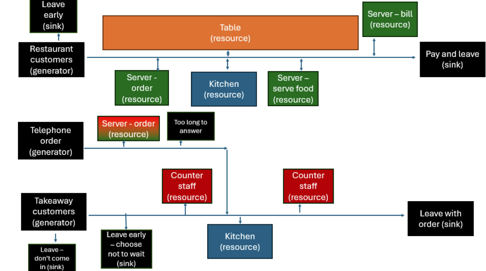
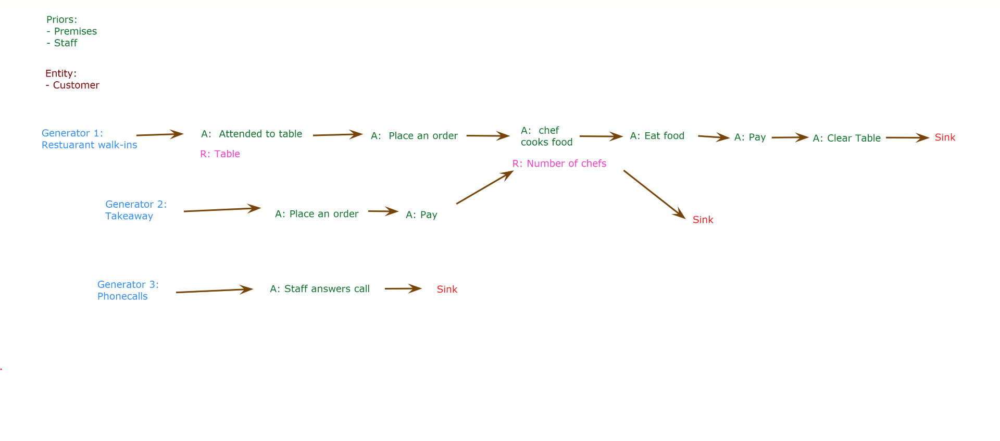
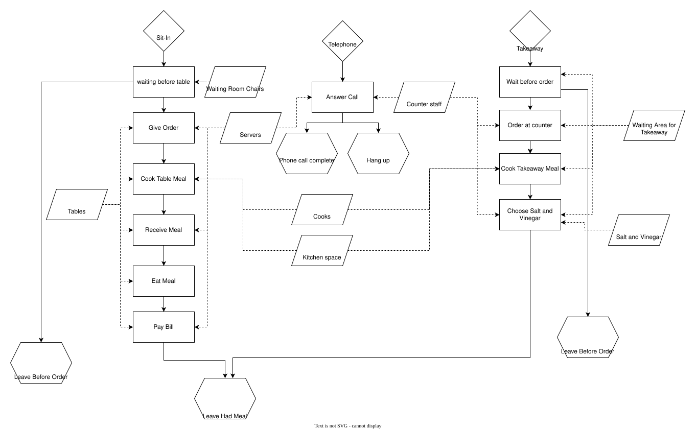
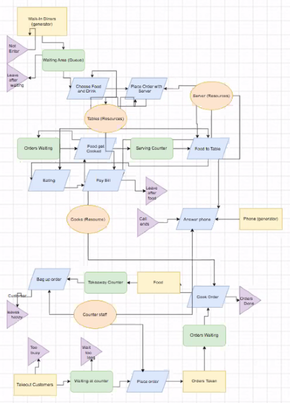

**Let’s Go! An Introduction to Discrete Event Simulation and SimPy**

A standalone workshop for the NHS-OA community from the team behind the ARC South West Health Service Modelling Associates (HSMA) Programme.

Start with the overview, check the itinerary, or go straight to the slides and exercises in Part 1 and Part 2. Visit Additional resources and next steps to keep learning after the workshop.

```{=html}
<style>
#workshop-tabs .nav-tabs {
  flex-wrap: wrap;
}
#workshop-tabs iframe {
  width: 100%;
  max-width: 100%;
  border: 0;
}
#workshop-tabs .workshop-slides {
  height: auto;
  aspect-ratio: 16 / 9;
}
</style>
```

::::: {.panel-tabset #workshop-tabs}

## Overview

### Why discrete event simulation?

Discrete Event Simulation (DES) is a simulation modelling technique that helps us tackle queuing problems in health and social care. These might include identifying delays in patient pathways and testing the impact of reconfiguring processes and resources to reduce those delays.

DES projects in the HSMA Programme have led to significant impact nationally, including:

- **Mental health care in Devon:** the construction of an £11.8 million new mental health ward to allow patients in crisis to be seen closer to home. [Read the project poster](https://hsma.co.uk/impact_posters/Out%20of%20Area%20Reduction%20in%20Mental%20Health.png).
- **Urgent care in London:** transformative improvements to urgent care delivery. [Read the project poster](https://hsma.co.uk/impact_posters/UTC%20Flow.png).
- **Stroke care in Kent:** potential annual savings of £1 million or more and improved patient outcomes. [Read the project poster](https://hsma.co.uk/impact_posters/Using%20Simulation%20to%20Improve%20Stroke%20Care%20and%20Reduce%20Costs.png).

### What you will learn

- The principles of DES and the kinds of problems this modelling approach can tackle.
- The importance of variability and stochasticity in simulation modelling.
- How to design reproducible stochastic models.
- How to build these models in Python using SimPy, including Python generator functions and structuring code using object oriented programming.
- How to add animated visualisations to SimPy models using the vidigi package.

::: {.callout-note}
### Experience and preparation

**Some prior coding experience is recommended, but no Python experience is assumed.** You will be introduced to the components of a SimPy model and the Python code used to build them, then have a chance to adapt the code to write your own models.

**No local Python installation is required.** We will use Google Colab to write and run code. You will need a free Google account.
:::

### About this workshop

This workshop pilots new content and exercises written for the upcoming seventh round of the HSMA Programme, due to launch in 2027. [Find out more about the HSMA Programme](https://hsma.co.uk/).

## Itinerary

[Open the itinerary in Google Sheets](https://docs.google.com/spreadsheets/d/1XLAVy8KAFmkYKRLZU2RxCOrApnFvU-UY2gQpQNYhf2Y/edit?usp=sharing) · [Download the itinerary (PDF)](nhs_oa_workshop_des/NHS_OA_DES_Workshop_Itinerary%20-%20Sheet1.pdf){download=""}

```{=html}
<iframe width='1280' height='500' src='https://docs.google.com/spreadsheets/d/e/2PACX-1vRFmR7cVQMgkC5A4xSk4zdQl_sVhJLK8k98D7C1ozoBnZj3yI_-gz8TtqwgdHtxwuAx_cMJDs3nqZkn/pubhtml?gid=0&amp;single=true&amp;widget=true&amp;headers=false' title='NHS OA DES workshop itinerary'></iframe>
```

## Part 1: DES & SimPy

An introduction to discrete event simulation (DES) concepts and SimPy, followed by three exercises.

:::: {.panel-tabset}

### Slides & video

[Open the DES and SimPy slides](https://docs.google.com/presentation/d/1uN0PsRhS8JVBUdSLZfYA4MXKmgg0X6UHP57CxQYuCas/edit?usp=sharing) · [Download the slides (PDF)](nhs_oa_workshop_des/NHS_OA_Intro_to_DES_and_SimPy.pdf){download=""}

```{=html}
<iframe class='workshop-slides' width='1280' height='600' src='https://docs.google.com/presentation/d/1uN0PsRhS8JVBUdSLZfYA4MXKmgg0X6UHP57CxQYuCas/embed?start=false&loop=false&delayms=3000' title='Introduction to DES and SimPy slides' loading='lazy' allowfullscreen></iframe>
```

#### Video

The workshop content begins at the timestamp 10:42.




### Exercise 1: DES Playground

Explore the DES Playground to try out simulation concepts.

Open the DES Playground in a new tab for the best experience - [click here: playground.hsma.co.uk](https://playground.hsma.co.uk)

```{=html}
<iframe width='1280' height='700' src='https://playground.hsma.co.uk' title='DES Playground' loading='lazy'></iframe>
```

### Exercise 2: Chalk's Chips

Design a DES model for a fish and chip shop. Read the brief below, then compare your design with the proposed solutions when you are ready.

::: {.callout-tip}
#### Exercise instructions


Chalk’s Chips is the number 1 fish and chip establishment in Cornwall, thanks to the passion, ingenuity and foresight of its owner - Dan Chalk.  Nevertheless, Dan is keen to see if things can be improved even further to make things more efficient, and generate even more cash to spend on pasties.  To this end, he’d like to use Discrete Event Simulation to model his chip shop to see how everything’s running, and has asked you to draft a design for what that model might look like.

Chalk’s Chips offers both a sit-in restaurant service and a takeaway service.

##### Restaurant

- The restaurant doesn’t take bookings, and instead operates a walk-in service, with a waiting area where prospective diners can wait for a table, although when it’s particularly busy, customers may either leave if they’re waiting too long, or not enter if they see the waiting area is too busy.
- Once a table is free, customers choose their food and drink from chalkboard menus on the table (nice touch), and shortly after a server will take their order.
- The server passes the order over to the kitchen, and when the cooks are free, the meals are cooked up, and left on the serving counter for a server to take to the table.
- Once diners have finished eating, a server presents them with a bill which they pay for at the table, before leaving.

##### Takeaway

- The takeaway service operates in a separate part of the building with its own entrance and counter, overlooking the Chalk’s Chips kitchen.
- Customers order at the counter with a member of counter staff, and then wait for the food to be cooked in the kitchen.
- Once the order’s ready it’s placed into the hot counter, and when a member of counter staff is ready, they call out the customer’s name, ask them if they want salt and vinegar to be applied, and bag up the order before handing it to the customer, who then leaves.
- When the takeaway service is particularly busy, some customers may choose not to wait before they’ve ordered their food, or choose not to come in in the first place if they see it’s too busy in there.

##### Telephone

Chalk’s Chips also has a telephone situated in the lobby, which is located between the takeaway and restaurant areas.  Phone calls are answered by either restaurant servers or counter staff, depending on whoever’s free at the time, though if there’s no answer for a while, it’s not unusual for the caller to hang up.

##### Activity

> You need to draw up a diagram (if you’re stuck for what to use, you might try https://www.drawio.com/)  for what a DES model of Chalk’s Chips could look like.  In particular, you should clearly indicate :
> - The generators and sinks, what they represent, and which entities the generators are bringing into being
> - The activities to be modelled, what resources are needed (if any) for each activity, and what the associated queue represents in terms of the resources it’s waiting for (if applicable)
>
> If you manage to do all that in the time, consider if there are any attributes that the entities might have that might be useful to model.
>
> When we come back we’ll ask a few groups to present their designs.  There are no right or wrong answers here - we do have a “Potential Solution” but model design is an art form, and there may be different ways you come up with to model the system (IMPORTANT - you would also normally design a model based on the “what if?” questions it needs to answer, which you don’t know here)
:::


::::: {.callout-tip collapse="true"}
#### Proposed solutions — expand when you are ready

Explore the workshop example and four proposed solutions created by the groups on the day. These show different approaches to modelling the same system; there is no single correct design. Select a tab to view a solution, and use the full-size image link to inspect the detail.

:::: {.panel-tabset}

##### Workshop example

[Open the workshop example at full size](assets/2026-09-30-12-06-54.png){target="_blank" rel="noopener"}

{width=100% fig-alt="Workshop example: Chalk's Chips DES model diagram."}

##### Blockers

[Open the Blockers solution at full size](nhs_oa_workshop_des/chalks_chips_blockers.png){target="_blank" rel="noopener"}

{width=100% fig-alt="Blockers group: proposed Chalk's Chips DES model diagram."}

##### Bombers

[Open the Bombers solution at full size](nhs_oa_workshop_des/chalks_chips_bombers.png){target="_blank" rel="noopener"}

{width=100% fig-alt="Bombers group: proposed Chalk's Chips DES model diagram."}

##### Builders

[Open the Builders solution at full size](nhs_oa_workshop_des/chalks_chips_builders.svg){target="_blank" rel="noopener"}

{width=100% fig-alt="Builders group: proposed Chalk's Chips DES model diagram."}

##### Floaters

[Open the Floaters solution at full size](nhs_oa_workshop_des/chalks_chips_floaters.png){target="_blank" rel="noopener"}

{width=564 fig-alt="Floaters group: proposed Chalk's Chips DES model diagram."}

::::

:::::


### Exercise 3: SimPy model

Explore and edit a SimPy model using the workshop notebook.

[Open the notebook in Google Colab](https://colab.research.google.com/drive/1oXfZvHvxcUFfJIzw51UdIxoijSHOBP0o?usp=sharing) · [Download the notebook (.ipynb)](nhs_oa_workshop_des/nhs_oa_des_workbook.ipynb){download=""}

If you cannot access Google Colab, download the notebook and open it in an IDE such as VS Code or Positron.

::: {.callout-tip collapse="true"}
#### Solution notebook — expand when you are ready

[Open the solution in Google Colab](https://colab.research.google.com/drive/1lzfzRdtRIbQ51oyEJckz8RqyDauOPlCm?usp=sharing) · [Download the solution notebook (.ipynb)](nhs_oa_workshop_des/nhs_oa_des_workbook_solution.ipynb){download=""}
:::

::::

## Part 2: Visualisation & vidigi

Visualisation with vidigi and resources to continue your DES journey.

:::: {.panel-tabset}

### Slides & video

[Open the vidigi slides on the web](https://hsma-programme.github.io/nhs_oa_vidigi_slides/) · [Download the introduction to animation in DES slides (Animaniacs PDF)](nhs_oa_workshop_des/NHS%20OA%20Intro%20to%20DES%20and%20SimPy%20slides%20-%20Animaniacs.pdf){download=""}

For the best experience, use the 'on the web' link above or the preview below. Use your left and right arrow keys to navigate through the slides, or click the three horizontal lines in the bottom left corner to open up the table of contents.

```{=html}
<iframe class='workshop-slides' width='1280' height='600' src='https://hsma-programme.github.io/nhs_oa_vidigi_slides/' title='Visualisation with vidigi slides' loading='lazy' allowfullscreen></iframe>
```

#### Video




### Exercises: vidigi Playground

Use the vidigi Playground for the visualisation exercises.

Open the vidigi Playground in a new tab for the best experience - [click here: hsma-programme.github.io/nhs_oa_vidigi_streamlit](https://hsma-programme.github.io/nhs_oa_vidigi_streamlit/)

```{=html}
<iframe width='1280' height='700' src='https://hsma-programme.github.io/nhs_oa_vidigi_streamlit/' title='vidigi Playground' loading='lazy'></iframe>
```

::::

## Additional resources and next steps

Continue your DES journey with the resources and opportunities from slides 82–93 of the workshop presentation.

### Keep learning

| Resource | What you will find |
|---|---|
| [HSMA 6 DES recordings](/des.qmd) | Full recordings and exercises from the DES module. Explore the [other HSMA modules](/modules.qmd) too. |
| [The Little Book of DES](https://des.hsma.co.uk/) | A free book covering the HSMA 6 DES material and more advanced concepts. |
| [DES RAP Book](https://pythonhealthdatascience.github.io/des_rap_book/) | Amy Heather’s guide to reproducible DES modelling in Python and R. |
| [Healthcare Services Analytics & Decision Support Atlas](https://atlas.hsma.co.uk/techniques/des/) | DES resources and models from the NHS and related organisations. |
| [vidigi documentation](https://hsma-tools.github.io/vidigi/) | A getting started guide and examples for adding animation to your own models. |

The HSMA 6 recordings and Little Book of DES use an earlier model structure than the one taught in this workshop, but remain useful for developing your understanding.

### Put your learning into practice

- **Read, run and reuse an existing model.** The Strategy Unit’s [ReModel Club](https://the-strategy-unit.github.io/ReModel-docs/) brings people together to run, assess and adapt open healthcare simulation models. [Find out how to join](https://the-strategy-unit.github.io/ReModel-docs/join-us/#register-for-remodel).
- **Share what you build.** If you create a model after this workshop, we would love to hear about it. Email [penchord@exeter.ac.uk](mailto:penchord@exeter.ac.uk) or tag the team in the NHS-OA Slack.
- **Keep in touch.** Email [penchord@exeter.ac.uk](mailto:penchord@exeter.ac.uk?subject=HSMA%20mailing%20list) to ask to join the HSMA mailing list, or [follow HSMA on LinkedIn](https://www.linkedin.com/company/hsma-programme/).

### Take the next step with HSMA 7

HSMA 7 will include an expanded DES module with over 30 hours of content. Alongside DES, HSMA 7 will cover geographic modelling and machine learning, as well as developing skills in web application development, interactive reporting, data visualisation and automation.

The programme combines learning with a project for your organisation:

1. **Learn:** six months of training, one day a week.
2. **Apply:** nine months working on a real project, with an expectation of one day a week and guidance and support.
3. **Implement:** support for implementation and gathering evidence of impact from month 15 onwards.

[Explore HSMA 7 and the latest application information](/hsma7.qmd).

### Revisit the additional resource slides

[Download slides 82–93 (PDF)](nhs_oa_workshop_des/NHS_OA_Additional_Resources_and_Next_Steps.pdf){download=""} · [Open the full presentation in Google Slides](https://docs.google.com/presentation/d/1uN0PsRhS8JVBUdSLZfYA4MXKmgg0X6UHP57CxQYuCas/edit?usp=sharing)

The excerpt from the part 1 slides below includes the resource links, HSMA programme information and participant feedback shown in the workshop. If the preview is unavailable on your device, use the PDF download link above.

```{=html}
<iframe width='1280' height='700' src='nhs_oa_workshop_des/NHS_OA_Additional_Resources_and_Next_Steps.pdf' title='Additional resources and next steps: workshop slides 82 to 93' loading='lazy'></iframe>
```


:::::
