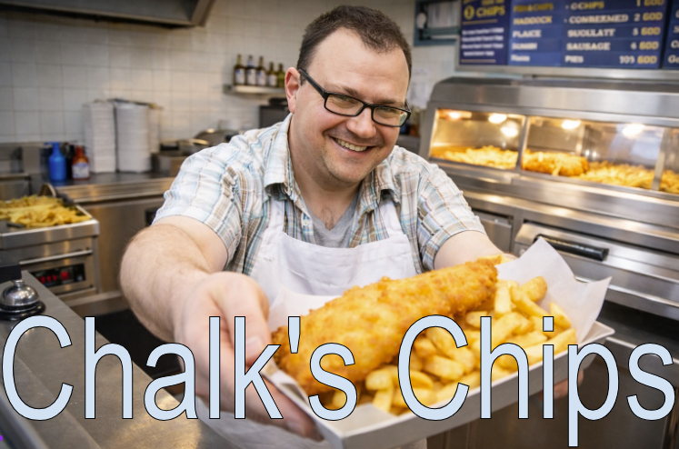
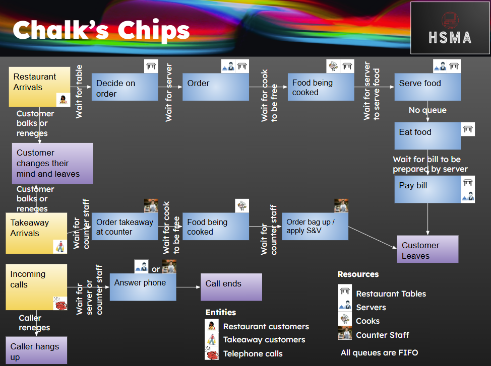

## Itinerary

```{=html}
<iframe width='1280' height='500' src='https://docs.google.com/spreadsheets/d/e/2PACX-1vRFmR7cVQMgkC5A4xSk4zdQl_sVhJLK8k98D7C1ozoBnZj3yI_-gz8TtqwgdHtxwuAx_cMJDs3nqZkn/pubhtml?gid=0&amp;single=true&amp;widget=true&amp;headers=false' title='Quarto Documentation'></iframe>
```

Click [here](https://docs.google.com/spreadsheets/d/1XLAVy8KAFmkYKRLZU2RxCOrApnFvU-UY2gQpQNYhf2Y/edit?usp=sharing) to open in a new window.

[Click here to download the itinerary (PDF)](nhs_oa_workshop_des/NHS_OA_DES_Workshop_Itinerary%20-%20Sheet1.pdf){download=""}

## Slides

### Part 1

```{=html}
<iframe width='1280' height='600' src='https://docs.google.com/presentation/d/1uN0PsRhS8JVBUdSLZfYA4MXKmgg0X6UHP57CxQYuCas/embed?start=false&loop=false&delayms=3000' title='Quarto Documentation'></iframe>
```

Click [here](https://docs.google.com/presentation/d/1uN0PsRhS8JVBUdSLZfYA4MXKmgg0X6UHP57CxQYuCas/edit?usp=sharing) to open in a new window.

[Click here to download the slides for the intro to DES and SimPy as a PDF](nhs_oa_workshop_des/NHS_OA_Intro_to_DES_and_SimPy.pdf){download=""}


#### Chalk's Chips Exercise



Chalk’s Chips is the number 1 fish and chip establishment in Cornwall, thanks to the passion, ingenuity and foresight of its owner - Dan Chalk.  Nevertheless, Dan is keen to see if things can be improved even further to make things more efficient, and generate even more cash to spend on pasties.  To this end, he’d like to use Discrete Event Simulation to model his chip shop to see how everything’s running, and has asked you to draft a design for what that model might look like.

Chalk’s Chips offers both a sit-in restaurant service and a takeaway service.

- The restaurant doesn’t take bookings, and instead operates a walk-in service, with a waiting area where prospective diners can wait for a table, although when it’s particularly busy, customers may either leave if they’re waiting too long, or not enter if they see the waiting area is too busy.
- Once a table is free, customers choose their food and drink from chalkboard menus on the table (nice touch), and shortly after a server will take their order.
- The server passes the order over to the kitchen, and when the cooks are free, the meals are cooked up, and left on the serving counter for a server to take to the table.
- Once diners have finished eating, a server presents them with a bill which they pay for at the table, before leaving.

- The takeaway service operates in a separate part of the building with its own entrance and counter, overlooking the Chalk’s Chips kitchen.
- Customers order at the counter with a member of counter staff, and then wait for the food to be cooked in the kitchen.
- Once the order’s ready it’s placed into the hot counter, and when a member of counter staff is ready, they call out the customer’s name, ask them if they want salt and vinegar to be applied, and bag up the order before handing it to the customer, who then leaves.
- When the takeaway service is particularly busy, some customers may choose not to wait before they’ve ordered their food, or choose not to come in in the first place if they see it’s too busy in there.

Chalk’s Chips also has a telephone situated in the lobby, which is located between the takeaway and restaurant areas.  Phone calls are answered by either restaurant servers or counter staff, depending on whoever’s free at the time, though if there’s no answer for a while, it’s not unusual for the caller to hang up.


> You need to draw up a diagram (if you’re stuck for what to use, you might try https://www.drawio.com/)  for what a DES model of Chalk’s Chips could look like.  In particular, you should clearly indicate :
> - The generators and sinks, what they represent, and which entities the generators are bringing into being
> - The activities to be modelled, what resources are needed (if any) for each activity, and what the associated queue represents in terms of the resources it’s waiting for (if applicable)
>
> If you manage to do all that in the time, consider if there are any attributes that the entities might have that might be useful to model.
>
> When we come back we’ll ask a few groups to present their designs.  There are no right or wrong answers here - we do have a “Potential Solution” but model design is an art form, and there may be different ways you come up with to model the system (IMPORTANT - you would also normally design a model based on the “what if?” questions it needs to answer, which you don’t know here)


::: {.callout-tip collapse="true"}
### Click here to view a proposed solution to the exercise


:::


### Part 2

```{=html}
<iframe width='1280' height='600' src='https://hsma-programme.github.io/nhs_oa_vidigi_slides/ ' title='Quarto Documentation'></iframe>
```

Click [here](https://hsma-programme.github.io/nhs_oa_vidigi_slides/) to open in a new window.

- [Download the intro to animation in DES slides (Animaniacs) as a PDF](nhs_oa_workshop_des/NHS%20OA%20Intro%20to%20DES%20and%20SimPy%20slides%20-%20Animaniacs.pdf){download=""}

## Exercises

### DES Playground

```{=html}
<iframe width='1280' height='700' src='https://playground.hsma.co.uk' title='DES Playground'></iframe>
```

Click [here](https://playground.hsma.co.uk) to open in a new window.


### Vidigi Playground

```{=html}
<iframe width='1280' height='700' src='https://hsma-programme.github.io/nhs_oa_vidigi_streamlit/' title='Vidigi Playground'></iframe>
```

Click [here](https://hsma-programme.github.io/nhs_oa_vidigi_streamlit/) to open in a new window.
