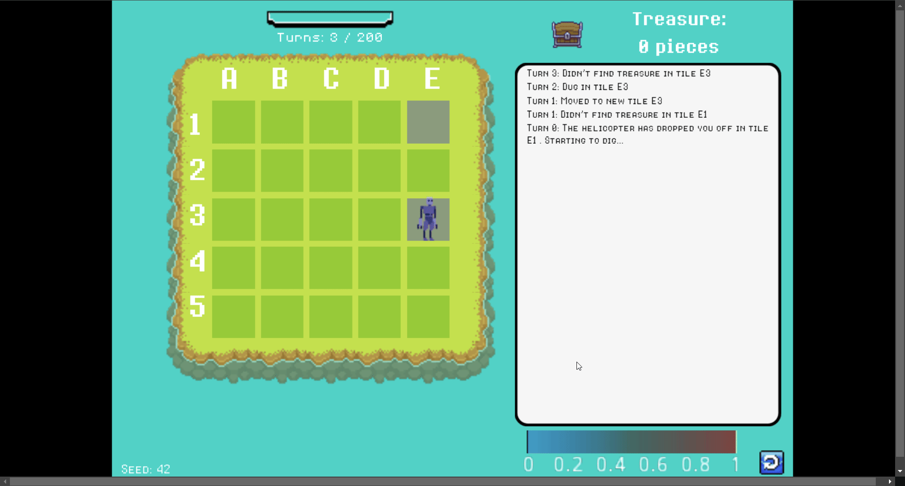
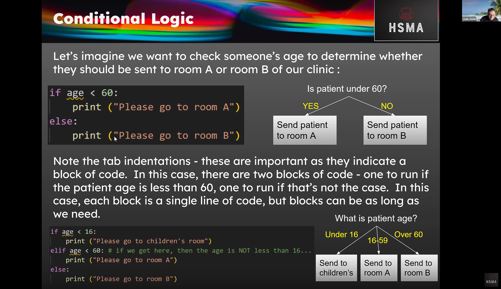
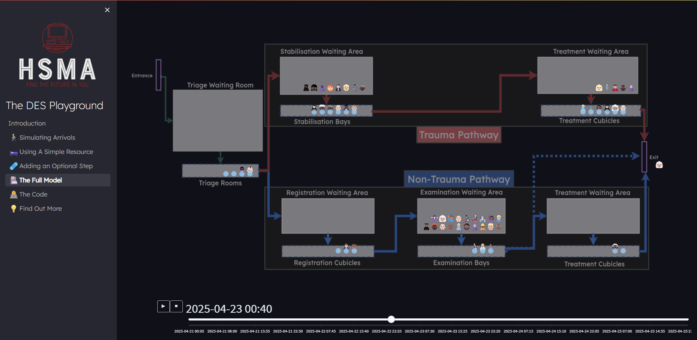
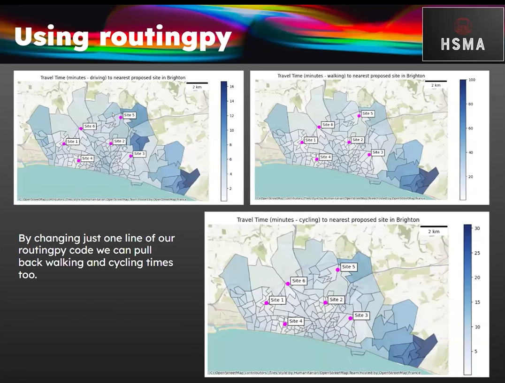
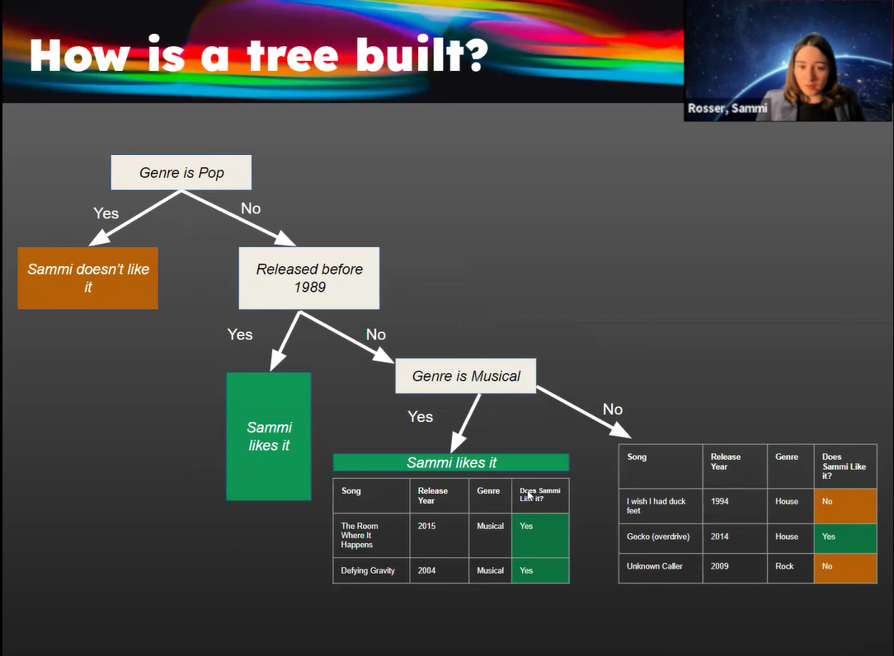
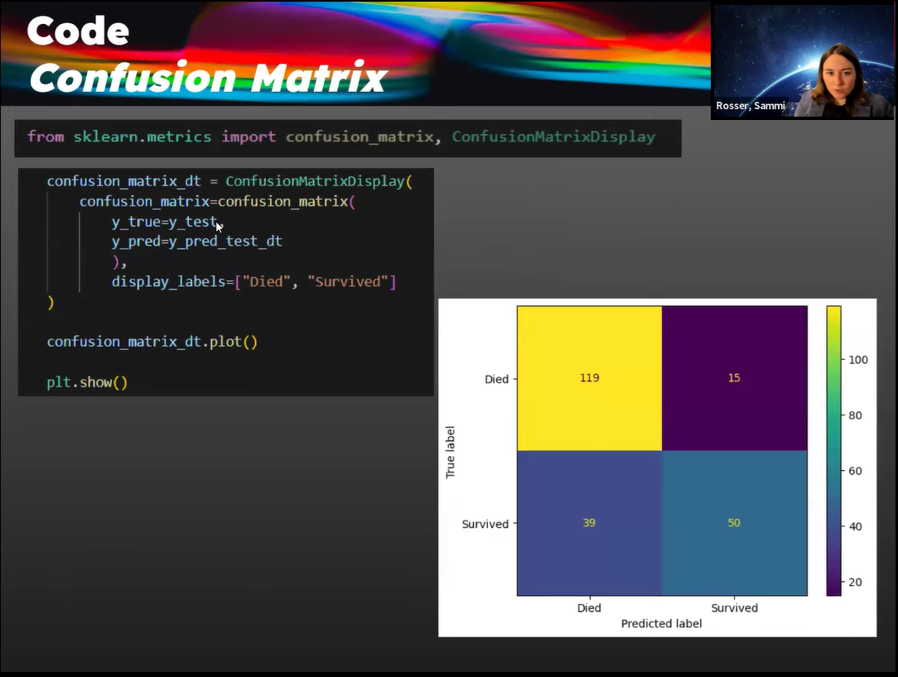
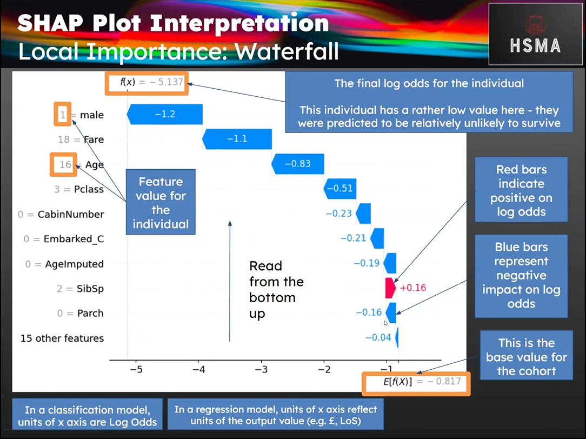
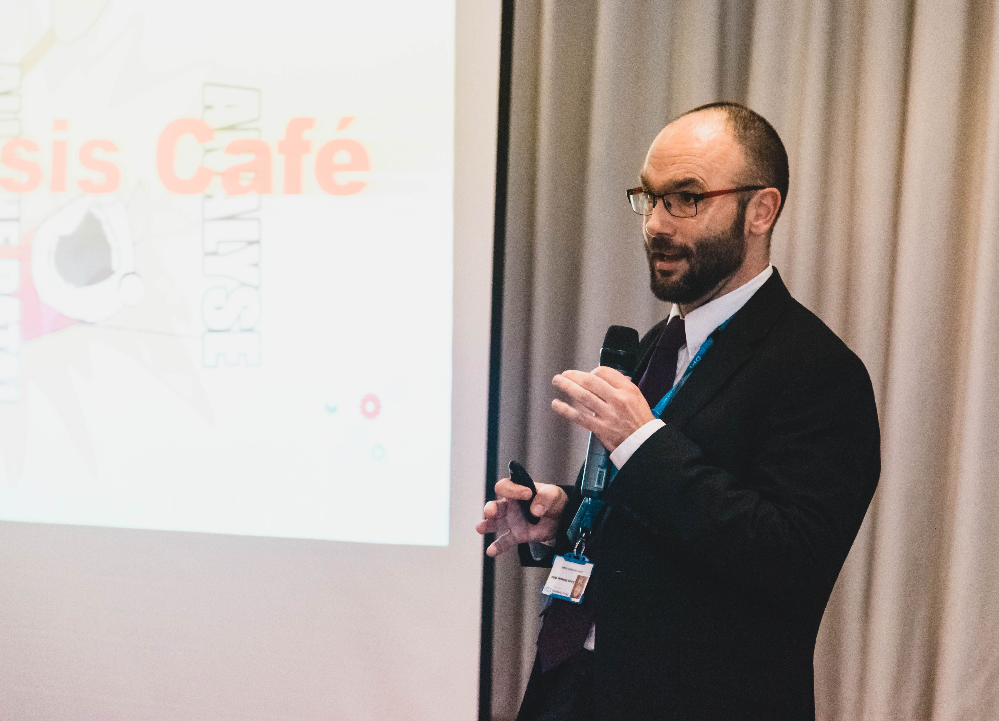
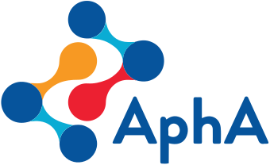

```{=html}
<style>
body {
	text-align: center;
}

h2 {
    text-transform: uppercase;
    font-weight: 400;
    text-align: center;
}

.splide__slide img {
  max-height: 450px;
  max-width: 80%;
  width: auto;
  height: auto;
}

h2-uncap {
    font-weight: 400;
    text-align: center;
    border-bottom: 1px solid rgb(67.15, 67.15, 67.15);
    padding-bottom: .5rem;
    margin-bottom: 1rem;
    color: inherit;
    font-size: calc(1.29rem + 0.48vw);
    line-height: 1.2;
    display: block;
    margin-block-start: 0.83em;
    margin-block-end: 0.83em;
    margin-inline-start: 0px;
    margin-inline-end: 0px;
    unicode-bidi: isolate;
}

.hsma_caption {
    padding: 30px 40px;
    font-weight:200;
}

.callout-title-container {
    font-size: 24px
}

.callout-body p {
    font-size: 16px
}
</style>

```

## What is HSMA?

The Health Service Modelling Associates (HSMA) Programme teaches public sector analysts, clinicians and managers how to use **data science** and **operational research** techniques, as well as supporting them to apply these techniques in their organisations.

The full HSMA course experience is provided **free of charge** to people working in health, social care and policing organisations in England.

Recordings of previous course sessions, as well as all of our course materials and code, are offered **free of charge** to anyone, anywhere in the world for personal use and adaptation.

::: {.splide-carousel preview="false" default-width="150px" toggle-text-color="#ffffff"}


















:::

```{=html}
<br/>
```

:::{.callout-important appearance="minimal"}
We are currently working on updating and improving HSMA ahead of the 7^th^ round of the programme, which we hope to launch in **early 2027**. There's some really exciting stuff planned for this round, so stay tuned! In the meantime, head to our [HSMA 7 page](hsma7.qmd) to find out more about what we'll be teaching, what's changed since HSMA 6, and answers to common questions.

We are also putting together a new series of standalone workshops aimed at senior leaders, called HSMA-λ (lambda), which we hope to run in **Autumn 2026**. Click [here](lambda.qmd) to find out more.

If you are interested in being kept up to date with HSMA and being notified of when applications for HSMA 7 or HSMA-λ open, please [drop us an email](mailto:penchord@exeter.ac.uk?subject=Add%20me%20to%20the%20HSMA%20Mailing%20List%2C%20Please!&body=Please%20complete%20the%20fields%20below%20to%20be%20added%20to%20the%20HSMA%20mailing%20list%0A%0AFull%20Name%3A%0A%0AOrganisation%3A%0A%0A**This%20is%20an%20automatically%20generated%20email%20from%20a%20link%20on%20the%20HSMA%20website**) and we will keep you informed via our mailing list.

You can also follow us on [LinkedIn](https://www.linkedin.com/company/hsma-programme/).

:::

```{=html}
<br/>
```

```{=html}
<br/><br/>
```

<h2-uncap>HSMA-λ (LAMBDA)</h2-uncap>

In Autumn 2026, we are planning to launch a new series of standalone 3-hour workshops targeted at decision makers in the health service.

HSMA-λ will focus on supporting participants to understand the advanced techniques that are taught on HSMA, empowering participants to **ask the right questions** and **interpret project outputs**.

Attendees will not require any prior experience in mathematics, data science, operational research or computer programming.

To find out more about our plans for HSMA-λ, head to [this page](lambda.qmd).

```{=html}
<br/><br/>
```


## Our Materials

Whether you are an alumni, current participant, or someone who is looking to learn data science and operational research on your own, you can access all our materials.

```{=html}
<div class="value-grid-box-2" style="justify-content:center; text-align:center;">
  <a href="https://hsma.co.uk/hsma_content/modules/modules.html" class="value-box bg-red">
    <div class="icon" style="font-size: 2rem;"><i class="bi bi-camera-reels"></i></div>
    <div class="details">Click here to access our HSMA 6 content recordings, slides and sample code</div>
  </a>
    <a href="https://hsma.co.uk/hsma_content/books/books.html" class="value-box bg-red">
    <div class="icon" style="font-size: 2rem;"><i class="bi bi-book"></i></div>
    <div class="details">Click here to view our teach-yourself ebooks on Python, geographic modelling, simulation (and more)</div>
  </a>
</div>
```

```{=html}
<br/><br/>
```


## Our Projects

While HSMA involves a large training element, the main focus of the programme is to support participants to undertake their own projects in their organisations.

On the website you can find more out about our [projects that are currently in progress](previous_projects/projects_in_progress.qmd) or [projects that have previously been undertaken](previous_projects/completed_projects.qmd).

You can also view projects [by method](previous_projects/projects_by_methods.qmd), [by area of application](previous_projects/projects_by_service_area.qmd), [by HSMA cohort](previous_projects/projects_by_cohort.qmd) or [by service](previous_projects/projects_by_organisation.qmd).

```{=html}
<br/><br/>
```


## Support and Accreditation


:::: {.columns}

::: {.column width="35%"}

```{=html}
<br/><br/>
```

{max-height=200}

:::

::: {.column width="5%"}

:::

::: {.column width="60%"}

```{=html}
<br/><br/>
```

HSMA is supported by the [NHS Digital Academy](https://www.england.nhs.uk/digitaltechnology/nhs-digital-academy/) and delivered by a team belonging to the [NIHR Applied Research Collaboration South West (ARC South West)](https://arc-swp.nihr.ac.uk/).


:::

::::


:::: {.columns}

::: {.column width="25%"}

{max-height=200}

:::

::: {.column width="15%"}

:::

::: {.column width="60%"}

```{=html}
<br/><br/>
```

The programme is accredited by the [Association of Professional Healthcare Analysts (AphA)](https://www.aphanalysts.org/)

:::

::::

```{=html}
<br/><br/>
```
