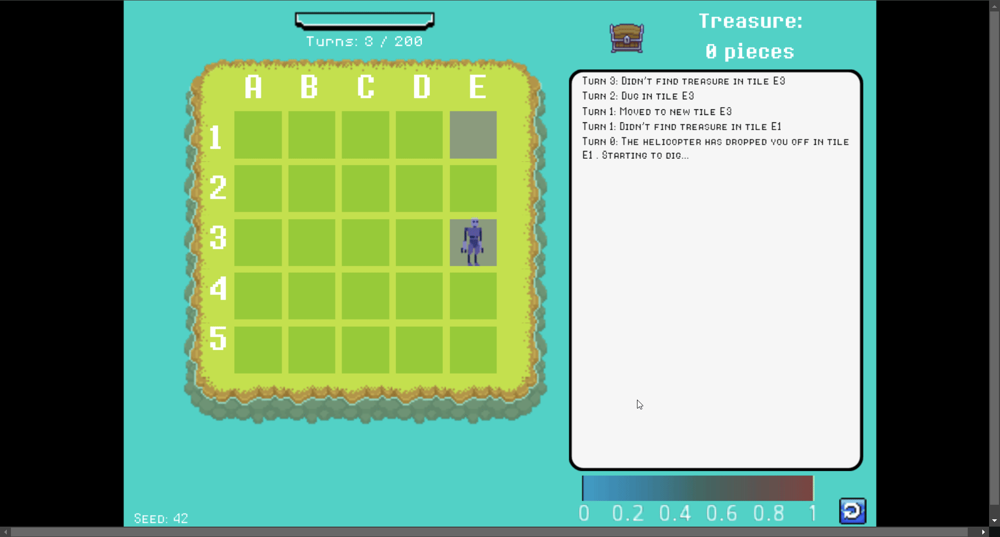
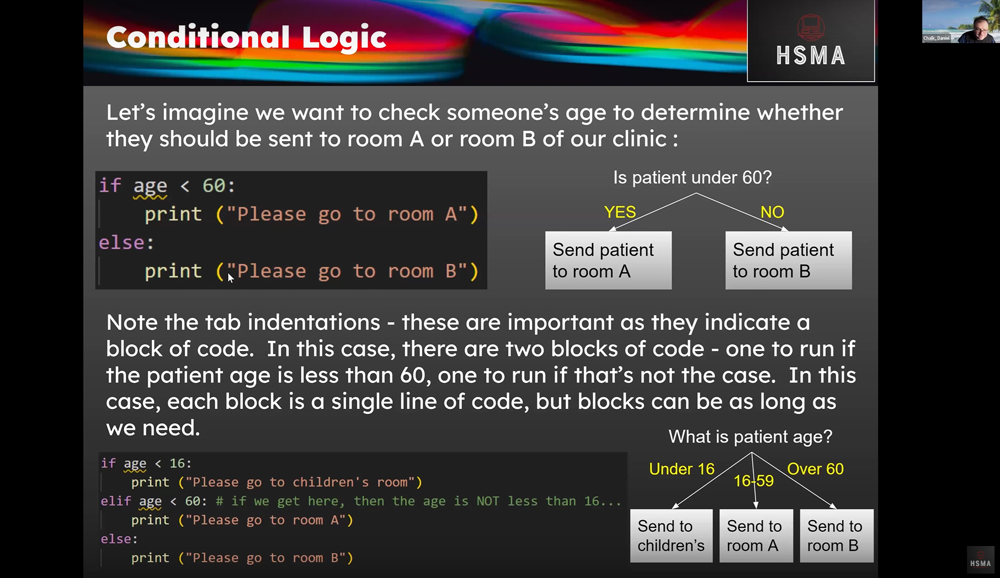
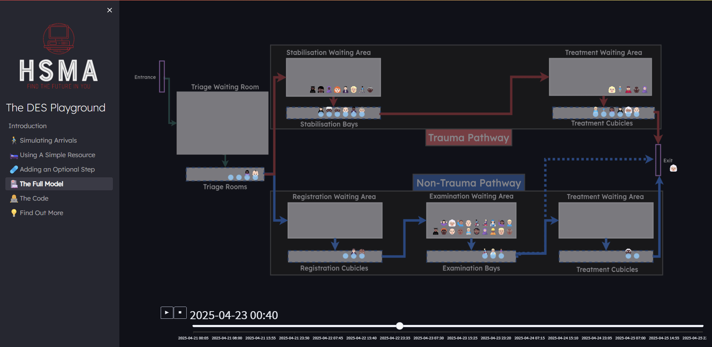
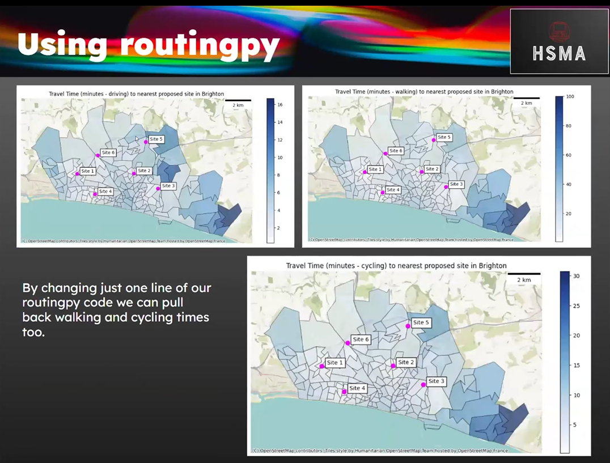
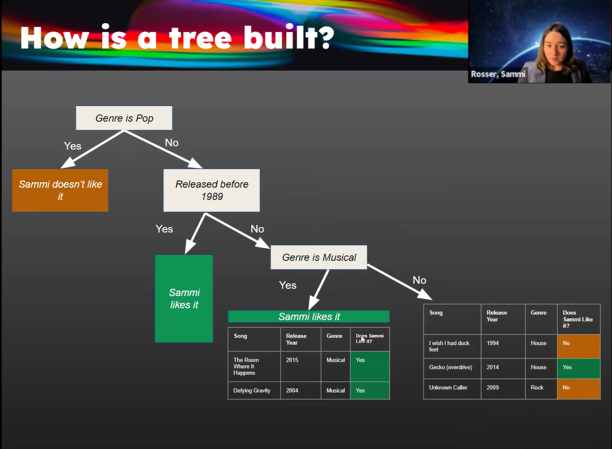
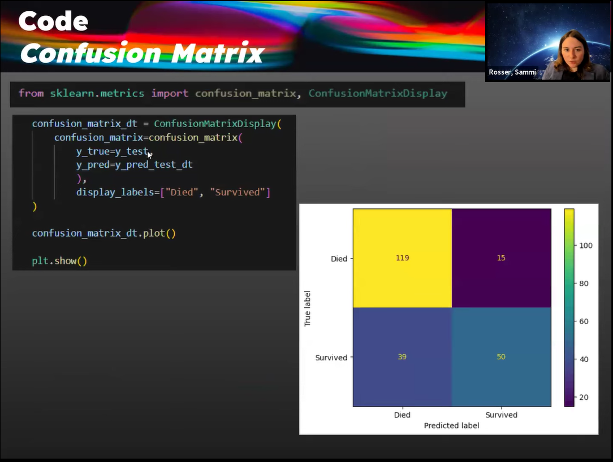
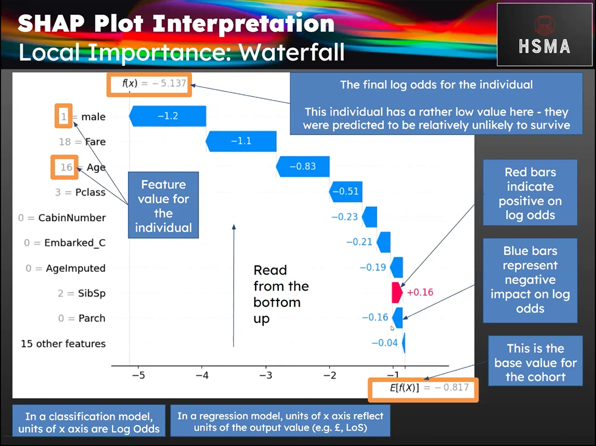
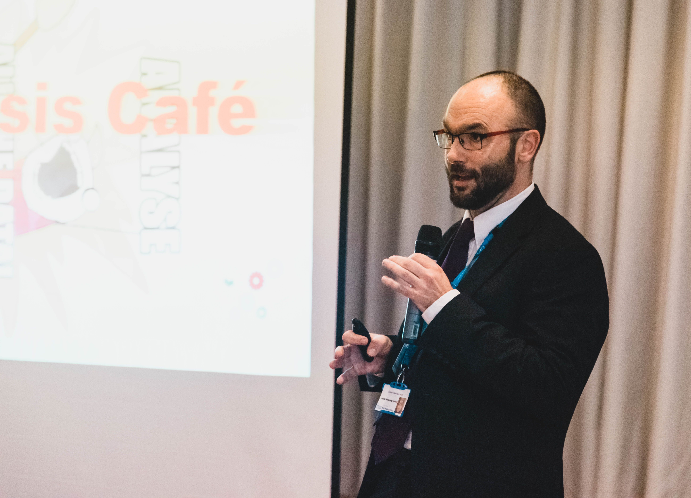
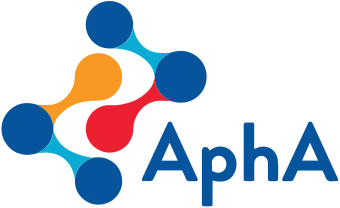

```{=html}
<style>
/* Centre the page content and title only, not the site-wide announcement banner */
#title-block-header,
#quarto-document-content {
	text-align: center;
}

#quarto-document-content h2 {
    text-transform: uppercase;
    font-size: 2rem;
    font-weight: 600;
    letter-spacing: 0.12em;
    text-align: center;
    margin-top: 4.5rem;
    margin-bottom: 1.75rem;
    /* Balances the trailing letter-spacing after the last letter so the text centres over the bar */
    padding-left: 0.12em;
    padding-bottom: 0;
    border-bottom: none;
    position: relative;
}

/* Take Quarto's hover anchor link out of the flow so it doesn't push the heading text off-centre */
#quarto-document-content h2 .anchorjs-link {
    position: absolute;
    padding-left: 0.4em;
}

#quarto-document-content #what-is-hsma > h2 {
    margin-top: 1.5rem;
}

/* Short red accent bar under each section heading */
#quarto-document-content h2::after {
    content: "";
    display: block;
    width: 110px;
    height: 4px;
    margin: 0.85rem auto 0 auto;
    border-radius: 2px;
    background-color: #c4161c;
}

@media (max-width: 600px) {
    #quarto-document-content h2 {
        font-size: 1.5rem;
        letter-spacing: 0.08em;
    }
}

/* Keeps the lowercase λ from being uppercased to Λ */
h2.no-caps, .no-caps h2 {
    text-transform: none;
}

.splide__slide img {
  max-height: 450px;
  max-width: 80%;
  width: auto;
  height: auto;
}

.stat-grid {
    display: grid;
    grid-template-columns: repeat(4, minmax(0, 1fr));
    gap: 1rem;
    margin: 2rem 0;
}

.stat-tile {
    display: flex;
    flex-direction: column;
    justify-content: center;
    padding: 1.25rem 0.75rem;
    border-radius: 10px;
    background-color: #9c000d;
    color: white;
    box-shadow: 0 4px 8px rgba(0, 0, 0, 0.15);
}

.stat-tile .stat-value {
    font-size: 2.2rem;
    font-weight: bold;
    line-height: 1.1;
}

.stat-tile .stat-label {
    margin-top: 0.4rem;
    font-size: 0.9rem;
    font-weight: 300;
    opacity: 0.9;
}

.cta-row {
    display: flex;
    flex-wrap: wrap;
    justify-content: center;
    gap: 0.75rem;
    margin: 1.5rem 0 0.5rem 0;
}

.cta-row .custom-button i {
    margin-right: 0.5rem;
}

.lambda-card {
    margin: 1.5rem auto 0 auto;
    max-width: 780px;
    padding: 2rem 2.5rem;
    border: 1px solid #3498db;
    border-radius: 12px;
    background: linear-gradient(135deg, rgba(52, 152, 219, 0.18) 0%, rgba(52, 152, 219, 0.04) 100%);
    box-shadow: 0 6px 18px rgba(0, 0, 0, 0.3);
}

.lambda-card .lambda-symbol {
    font-size: 3.5rem;
    line-height: 1;
    color: #5dade2;
    margin-bottom: 0.75rem;
}

.lambda-card .cta-row {
    margin-bottom: 0;
}

.value-grid-box-4 {
    display: grid;
    grid-template-columns: repeat(4, minmax(0, 1fr));
    gap: 1rem;
    margin-top: 1rem;
}

.value-grid-box-4 .value-box {
    min-height: 120px;
    padding: 1rem;
    background-color: #5a0000;
}

.value-grid-box-4 .value-box .icon {
    font-size: 1.6rem;
}

.value-grid-box a.value-box,
.value-grid-box-4 a.value-box {
    color: white;
}

@media (max-width: 900px) {
    .stat-grid,
    .value-grid-box-4 {
        grid-template-columns: repeat(2, minmax(0, 1fr));
    }
}

.support-row {
    display: grid;
    grid-template-columns: repeat(2, minmax(0, 1fr));
    gap: 2.5rem;
    align-items: start;
    margin-top: 2rem;
}

.support-item {
    display: flex;
    flex-direction: column;
    align-items: center;
    gap: 0.5rem;
}

.support-item img.support-logo-img {
    height: 110px;
    max-width: 100%;
    object-fit: contain;
}

@media (max-width: 600px) {
    .support-row {
        grid-template-columns: 1fr;
    }

    .lambda-card {
        padding: 1.5rem 1.25rem;
    }
}

.callout-title-container {
    font-size: 24px
}

.callout-body p {
    font-size: 16px
}

.featured-quote {
    position: relative;
    margin: 1.5rem auto 2rem auto;
    padding: 2.5rem 3rem 2rem 3rem;
    max-width: 820px;
    border-left: 6px solid #9c000d;
    border-radius: 10px;
    background: linear-gradient(135deg, rgba(156, 0, 13, 0.35) 0%, rgba(116, 0, 0, 0.12) 60%, rgba(255, 255, 255, 0.03) 100%);
    box-shadow: 0 6px 18px rgba(0, 0, 0, 0.35);
    text-align: left;
}

.featured-quote .quote-icon {
    position: absolute;
    top: -0.9rem;
    left: 1.25rem;
    font-size: 3.5rem;
    color: #e04a55;
    opacity: 0.6;
}

.featured-quote p {
    font-size: 1.3rem;
    font-style: italic;
    font-weight: 300;
    line-height: 1.6;
    margin-bottom: 1rem;
}

.featured-quote footer {
    text-align: right;
    font-size: 0.95rem;
    font-weight: 500;
    opacity: 0.8;
}

.quotes-splide {
    padding: 0 3rem 2.5rem 3rem;
}

.quotes-splide .splide__slide {
    display: flex;
    padding: 6px 0;
}

.quote-card {
    display: flex;
    flex-direction: column;
    justify-content: center;
    width: 100%;
    height: 100%;
    padding: 1.75rem 1.5rem 1.5rem 1.5rem;
    border-radius: 10px;
    background-color: #740000;
    color: white;
    box-shadow: 0 4px 8px rgba(0, 0, 0, 0.25);
    transition: transform 0.2s ease;
}

.quote-card:hover {
    transform: translateY(-4px);
}

.quote-card .quote-icon {
    font-size: 1.6rem;
    opacity: 0.5;
    margin-bottom: 0.75rem;
}

.quote-card p {
    font-size: 1.05rem;
    font-style: italic;
    line-height: 1.5;
    margin-bottom: 0.5rem;
}

.quote-card--long p {
    font-size: 0.92rem;
}

.quotes-splide .splide__arrow {
    background: #9c000d;
    opacity: 0.85;
}

.quotes-splide .splide__arrow svg {
    fill: white;
}

.quotes-splide .splide__arrow--prev {
    left: 0;
}

.quotes-splide .splide__arrow--next {
    right: 0;
}

.quotes-splide .splide__pagination {
    bottom: 0;
}

.quotes-splide .splide__pagination__page {
    background: #888;
}

.quotes-splide .splide__pagination__page.is-active {
    background: #e04a55;
}

@media (max-width: 600px) {
    .featured-quote {
        padding: 2.25rem 1.25rem 1.5rem 1.25rem;
    }

    .featured-quote p {
        font-size: 1.1rem;
    }

    .quotes-splide {
        padding: 0 0 2.5rem 0;
    }

    .quotes-splide .splide__arrows {
        display: none;
    }
}
</style>

```

## What is HSMA?

The Health Service Modelling Associates (HSMA) Programme is an **online** programme teaching public sector analysts, clinicians and managers how to use **data science** and **operational research** techniques, as well as supporting them to apply these techniques in their organisations.

```{=html}
<div class="stat-grid">
  <div class="stat-tile">
    <div class="stat-value">2016</div>
    <div class="stat-label">First HSMA cohort</div>
  </div>
  <div class="stat-tile">
    <div class="stat-value">400+</div>
    <div class="stat-label">People supported over 6 cohorts</div>
  </div>
  <div class="stat-tile">
    <div class="stat-value">15</div>
    <div class="stat-label">Months of training and mentorship, for one day a week</div>
  </div>
  <div class="stat-tile">
    <div class="stat-value">£0</div>
    <div class="stat-label">Course fees for health, social care and policing in England</div>
  </div>
</div>
```

Recordings of previous course sessions, as well as all of our course materials and code, are offered **free of charge** to anyone, anywhere in the world for personal use and adaptation.

::: {.splide-carousel preview="false" default-width="150px" toggle-text-color="#ffffff"}


















:::

:::{.callout-important appearance="minimal"}
We are currently working on updating and improving HSMA ahead of the 7^th^ round of the programme, which we hope to launch in **spring/summer 2027**. There's some really exciting stuff planned for this round, so stay tuned! In the meantime, head to our [HSMA 7 page](hsma7.qmd) to find out more about what we'll be teaching, what's changed since HSMA 6, and answers to common questions.

We are also putting together a new series of standalone workshops aimed at senior leaders, called HSMA-λ (lambda), which we hope to run in **winter 2026/27 – spring 2027**.

Want to hear when applications for HSMA 7 or HSMA-λ open? Join our mailing list, register your interest in HSMA-λ, or follow us on LinkedIn.

```{=html}
<div class="cta-row">
  <a class="custom-button" href="mailto:penchord@exeter.ac.uk?subject=Add%20me%20to%20the%20HSMA%20Mailing%20List%2C%20Please!&body=Please%20complete%20the%20fields%20below%20to%20be%20added%20to%20the%20HSMA%20mailing%20list%0A%0AFull%20Name%3A%0A%0AOrganisation%3A%0A%0A**This%20is%20an%20automatically%20generated%20email%20from%20a%20link%20on%20the%20HSMA%20website**"><i class="bi bi-envelope"></i>Join the mailing list</a>
  <a class="custom-button" href="https://forms.cloud.microsoft/e/spFr8qr2pP"><i class="bi bi-pencil-square"></i>Register λ interest</a>
  <a class="custom-button" href="https://www.linkedin.com/company/hsma-programme/"><i class="bi bi-linkedin"></i>Follow on LinkedIn</a>
</div>
```

:::

## What Our Students Say

```{=html}
<blockquote class="featured-quote">
  <i class="fa-solid fa-quote-left quote-icon" aria-hidden="true"></i>
  <p>Overall, my HSMA journey has been a transformative experience, opening me up to new approaches to analytics in the NHS. I found the real-world problem-solving expertise and the community support invaluable. From an organisational perspective, it’s a strategic investment in operational service development and decision-making ability.</p>
  <footer>— HSMA Alumni</footer>
</blockquote>

<section id="student-quotes" class="splide quotes-splide" aria-label="Quotes from previous HSMA students">
  <div class="splide__track">
    <ul class="splide__list">
      <li class="splide__slide">
        <div class="quote-card">
          <i class="fa-solid fa-quote-left quote-icon" aria-hidden="true"></i>
          <p>HSMA is an absolutely amazing programme that's taken me from zero coding knowledge to inspiring me to want to go off and explore on my own.</p>
        </div>
      </li>
      <li class="splide__slide">
        <div class="quote-card">
          <i class="fa-solid fa-quote-left quote-icon" aria-hidden="true"></i>
          <p>I can honestly say it is the best training I've ever participated in. For the first time in a long time I feel really enthused about my work.</p>
        </div>
      </li>
      <li class="splide__slide">
        <div class="quote-card">
          <i class="fa-solid fa-quote-left quote-icon" aria-hidden="true"></i>
          <p>The HSMA community is just wonderful - really friendly, open and collaborative. The teaching was well paced and I was made to feel like there were no silly questions. As a complete code novice, I really appreciated it!</p>
        </div>
      </li>
      <li class="splide__slide">
        <div class="quote-card">
          <i class="fa-solid fa-quote-left quote-icon" aria-hidden="true"></i>
          <p>The wealth of information and resources made available to me from this course will continue to be used for years.</p>
        </div>
      </li>
      <li class="splide__slide">
        <div class="quote-card quote-card--long">
          <i class="fa-solid fa-quote-left quote-icon" aria-hidden="true"></i>
          <p>Since completing the HSMA programme, I’ve found myself coding a lot more in my day-to-day role, which has really improved both the efficiency and depth of my work.</p>
          <p>It’s also shifted how I approach problem-solving. I now think more analytically and am more confident in exploring data-driven solutions.</p>
        </div>
      </li>
      <li class="splide__slide">
        <div class="quote-card">
          <i class="fa-solid fa-quote-left quote-icon" aria-hidden="true"></i>
          <p>This is by far the most enjoyable course I've undertaken in this career to date.</p>
        </div>
      </li>
    </ul>
  </div>
</section>

<script>
document.addEventListener('DOMContentLoaded', function () {
  new Splide('#student-quotes', {
    type: 'loop',
    perPage: 3,
    perMove: 1,
    gap: '1.25rem',
    autoplay: true,
    interval: 7000,
    pauseOnHover: true,
    breakpoints: {
      900: { perPage: 2 },
      600: { perPage: 1 }
    }
  }).mount();
});
</script>
```

## HSMA-λ (Lambda) {.no-caps}

::: {.lambda-card}

```{=html}
<div class="lambda-symbol">λ</div>
```

HSMA-λ is a new series of standalone 3-hour workshops for **decision makers** in the health service, launching in **winter 2026/27 – spring 2027**.

It focuses on understanding the advanced techniques taught on HSMA, empowering participants to **ask the right questions** and **interpret project outputs**. No prior experience in mathematics, data science, operational research or programming is needed.

```{=html}
<div class="cta-row">
  <a class="custom-button" href="lambda.html"><i class="bi bi-arrow-right-circle"></i>Find out more</a>
  <a class="custom-button" href="https://forms.cloud.microsoft/e/spFr8qr2pP"><i class="bi bi-pencil-square"></i>Register interest</a>
</div>
```

:::

## Our Materials

Whether you are an alumni, current participant, or someone who is looking to learn data science and operational research on your own, you can access all our materials.

```{=html}
<div class="value-grid-box-2" style="justify-content:center; text-align:center;">
  <a href="https://hsma.co.uk/hsma_content/modules/modules.html" class="value-box bg-red">
    <div class="icon" style="font-size: 2rem;"><i class="bi bi-camera-reels"></i></div>
    <div class="details">Click here to access our HSMA 6 content recordings, slides and sample code</div>
  </a>
    <a href="https://hsma.co.uk/hsma_content/books/books.html" class="value-box bg-red">
    <div class="icon" style="font-size: 2rem;"><i class="bi bi-book"></i></div>
    <div class="details">Click here to view our teach-yourself ebooks on Python, geographic modelling, simulation (and more)</div>
  </a>
</div>
```

## Our Projects

While HSMA involves a large training element, the main focus of the programme is to support participants to undertake their own projects in their organisations.

```{=html}
<div class="value-grid-box-2" style="grid-template-columns: 1fr;">
  <a href="impact.html" class="value-box" style="background-color: #c4161c; flex-direction: row; align-items: center; justify-content: center; gap: 1.25rem; min-height: 130px;">
    <div class="icon" style="font-size: 2.75rem; margin-bottom: 0;"><i class="bi bi-graph-up-arrow"></i></div>
    <div class="details" style="font-size: 1.6rem; font-weight: 500; text-align: left;">The impact of HSMA projects</div>
  </a>
</div>
<div class="value-grid-box-2">
  <a href="previous_projects/projects_in_progress.html" class="value-box bg-red" style="min-height: 130px; padding: 1rem;">
    <div class="icon" style="font-size: 2rem;"><i class="bi bi-hourglass-split"></i></div>
    <div class="details">Projects currently in progress</div>
  </a>
  <a href="previous_projects/completed_projects.html" class="value-box bg-red" style="min-height: 130px; padding: 1rem;">
    <div class="icon" style="font-size: 2rem;"><i class="bi bi-check2-circle"></i></div>
    <div class="details">Completed projects</div>
  </a>
</div>
<div class="value-grid-box-4">
  <a href="previous_projects/projects_by_methods.html" class="value-box">
    <div class="icon"><i class="bi bi-diagram-3"></i></div>
    <div class="details">Browse by method</div>
  </a>
  <a href="previous_projects/projects_by_service_area.html" class="value-box">
    <div class="icon"><i class="bi bi-heart-pulse"></i></div>
    <div class="details">Browse by area of care</div>
  </a>
  <a href="previous_projects/projects_by_cohort.html" class="value-box">
    <div class="icon"><i class="bi bi-people"></i></div>
    <div class="details">Browse by HSMA cohort</div>
  </a>
  <a href="previous_projects/projects_by_organisation.html" class="value-box">
    <div class="icon"><i class="bi bi-building"></i></div>
    <div class="details">Browse by organisation</div>
  </a>
</div>
```

## Support and Accreditation

:::: {.support-row}

::: {.support-item}

{.support-logo-img fig-alt="NIHR ARC South West logo"}

HSMA is supported by the [NHS Digital Academy](https://www.england.nhs.uk/digitaltechnology/nhs-digital-academy/) and delivered by a team belonging to the [NIHR Applied Research Collaboration South West (ARC South West)](https://arc-swp.nihr.ac.uk/).

:::

::: {.support-item}

{.support-logo-img fig-alt="AphA logo"}

The programme is accredited by the [Association of Professional Healthcare Analysts (AphA)](https://www.aphanalysts.org/).

:::

::::

```{=html}
<br/><br/>
```
