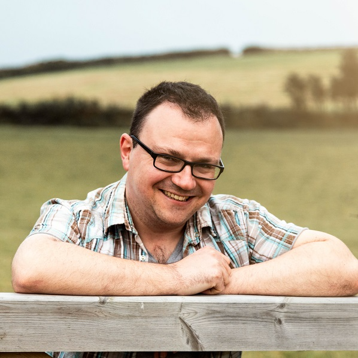
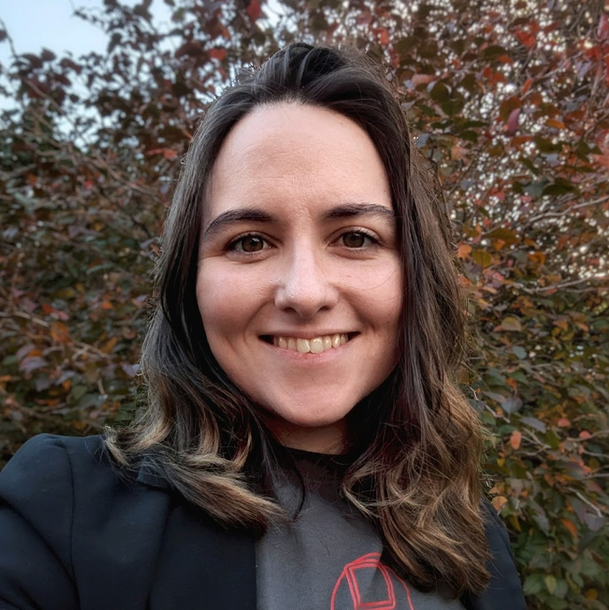
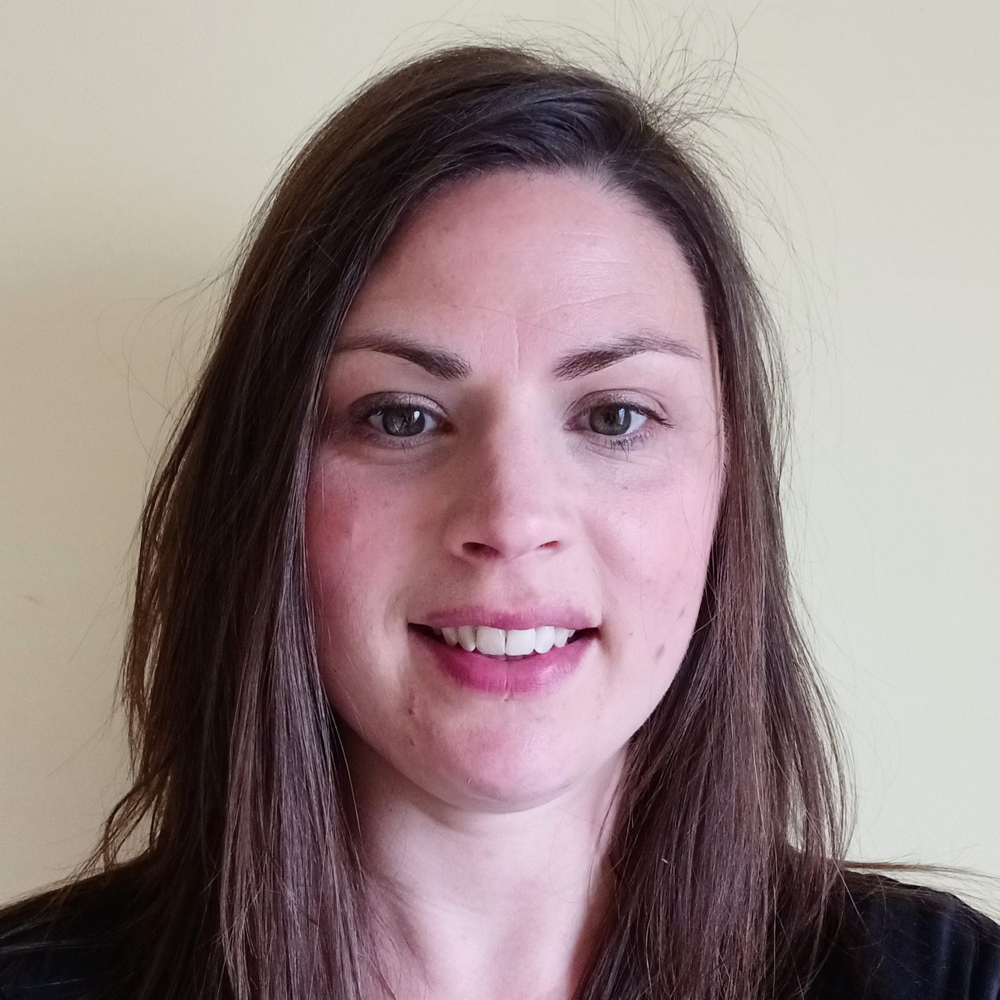

```{=html}
<script>
  AOS.init();
</script>
```

<div data-aos="fade-left">

# Dr Daniel Chalk
*HSMA Programme Lead*

:::: {.columns layout="[ 0.45, -0.03, 0.5 ]"}

::: {.column}

{fig-alt="A photo of Dr Daniel Chalk. The photo shows a smiling man with short dark hair and glasses. He is wearing a blue and brown checked shirt and leaning on a fence, with the Cornish countryside in the background."}
<br/><br/>
[<i class="fa-brands fa-orcid"></i> ORCiD](https://orcid.org/0000-0002-4165-4364){.btn .btn-primary .btn role="button"} [<i class="fa-brands fa-linkedin"></i> LinkedIn](https://www.linkedin.com/in/daniel-chalk-292b2b33b/){.btn .btn-primary .btn role="button"} [<i class="fa-brands fa-github"></i> GitHub](https://github.com/hsma-chief-elf){.btn .btn-primary .btn role="button"}

:::

::: {.column}

Dr Dan Chalk is a Senior Research Fellow at the NIHR Applied Research Collaboration for the South West Peninsula (PenARC), Director of the Health Service Modelling Associates (HSMA) Programme since its inception, and former chair of the PenCHORD research team.
<br/><br/>
He has nearly 15 years of experience collaborating with the NHS to apply Operational Research and Data Science methods to improve service delivery, with particular expertise in Discrete Event Simulation and Agent Based Simulation, and his work has led to reductions in cancer waiting times, supported end of life care resource planning, and fed into national policy making on diabetic retinopathy screening.
<br/><br/>
Dan has spent the last 12 years teaching and mentoring NHS staff to develop and apply skills in modelling and data science, and is a firm believer that anyone can be taught how to code and how to develop models with the right support. He is a passionate advocate of open science and the use of Free and Open Source solutions.

:::

::::

</div>

<div data-aos="fade-right">

# Sammi Rosser
*HSMA Trainer*

:::: {.columns layout="[ 0.50, -0.03, 0.45 ]"}

::: {.column}

Sammi Rosser is a research fellow and teacher with an interest in how data science and operational research approaches can be used to improve the lives of patients.
<br/><br/>
She is passionate about spreading the word about open approaches and empowering people to learn Python and apply it to healthcare problems. Her work focuses on pathway simulation modelling, geographic optimization, and data visualisation.
<br/><br/>
Sammi holds an MSc in Health Data Science from the University of Exeter, where her final project focussed on the use of free and open source web app frameworks to make more user-friendly tools in the NHS.
:::

::: {.column}

{fig-alt="A photo of Sammi Rosser. The photo shows a smiling woman with long wavy brown hair and brown eyes, wearing a grey t-shirt with a red HSMA logo on and a blazer. She is standing in front of a tree with autumnal red, golden and green foliage."}
<br/><br/>
[<i class="fa-brands fa-orcid"></i> ORCiD](https://orcid.org/0000-0002-9552-8988){.btn .btn-primary .btn role="button"} [<i class="fa-brands fa-linkedin"></i> LinkedIn](https://www.linkedin.com/in/sammijaderosser/){.btn .btn-primary .btn role="button"} [<i class="fa-brands fa-github"></i> GitHub](https://github.com/Bergam0t){.btn .btn-primary .btn role="button"}


:::

::::

</div>


<div data-aos="fade-left">


# Jemma Phillips
*HSMA Administrator*

:::: {.columns layout="[ 0.45, -0.03, 0.5 ]"}

::: {.column}

{fig-alt="A photo of Jemma Phillips. The photo shows a smiling woman with long straight brown hair and brown eyes, wearing a dark t-shirt."}

:::


::: {.column}

Jemma is a Research and Communications Administrator, supporting the Health Service Modelling Associates (HSMA) training programme and providing general communications and administrative support to the PenARC team.


:::

::::

</div>
